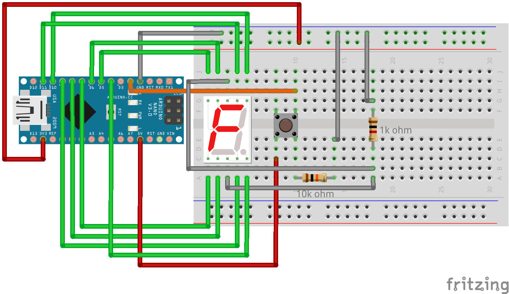
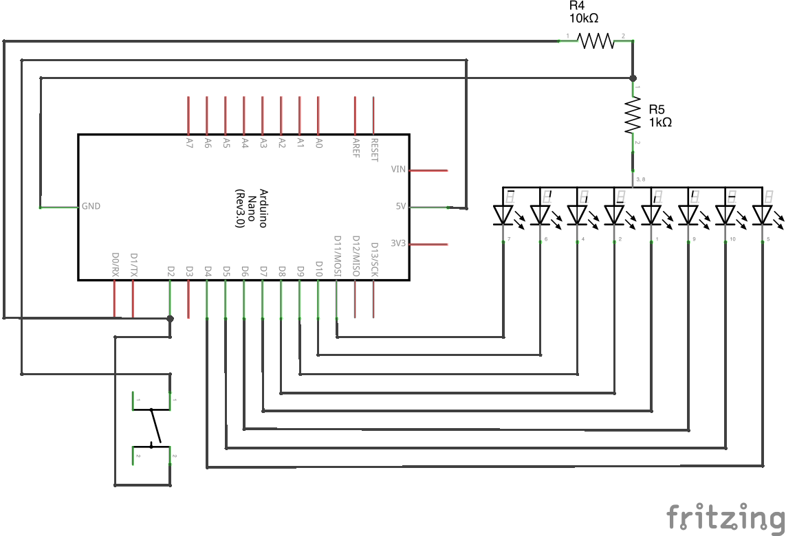

# Arduino Die Roller (cathode version)

An automatic die roller based on an Arduino Nano.

## Requirements

- Arduino
- Common Cathode 7 Segment Display
- 21 jumper wires (male to male)
- Tactile button
- 10k ohm resistor
- 1k ohm resistor

## How to use

Wire up above components as follows:

Upload the [.ino file](arduino_die_cathode.ino) to your Arduino using the [Arduino IDE](https://www.arduino.cc/en/software).

Press the tactile button to get an integer from 1 to 6.

## Schematics

